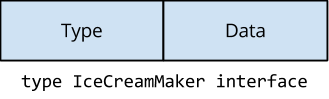
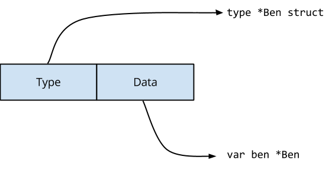
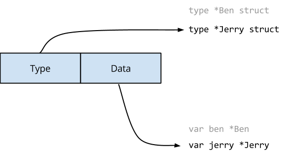

# Concurrency

## Любопытные каналы

Каналы являются характерной особенностью языка программирования Go. Каналы предоставляют мощный способ рассуждать о потоке данных от одной горутины к другой без использования блокировок или критических секций.

Я хочу рассказать о двух важных свойствах каналов, которые делают их полезными для управления не только потоком данных в программе, но и потоком управления.

### Закрытый канал никогда не блокируется

Первое свойство, о котором я хочу рассказать, - это закрытость канала. Если канал закрыт, вы не можете отправить значение по этому каналу, но можете получить значение из канала.

```go
package main

import "fmt"

func main() {
	ch := make(chan bool, 2)
	ch <- true
	ch <- true
	close(ch)

	for i := 0; i < cap(ch)+1; i++ {
		v, ok := <-ch
		fmt.Println(v, ok)
	}
}
```

В этом примере мы создаем канал с буфером из двух элементов, заполняем буфер, а затем закрываем его.

```
true true
true true
false false
```

Запуск программы показывает, что мы получаем первые два значения, отправленные в канал, а с третьей попытки канал выдаёт нам значения `false` и `false`. Первое значение `false` - это нулевое значение для типа канала, то есть `false`, так как канал имеет тип `chan bool`. Второе значение указывает на открытое состояние канала, которое теперь равно `false`, что означает, что канал закрыт. Канал будет продолжать сообщать эти значения бесконечно. В качестве эксперимента изменим этот пример так, чтобы прочитать из канала 100 раз.

Способность определять, закрыт ли канал, является полезным свойством, оно используется в идиоме "range over channel" для выхода из цикла после того, как канал был исчерпан.

```go
package main

import "fmt"

func main() {
	ch := make(chan bool, 2)
	ch <- true
	ch <- true
	close(ch)

	for v := range ch {
		fmt.Println(v) // вызывается дважды
	}
}
```

Но по-настоящему проявляет себя в сочетании с `select`. Начнём с такого примера:

```go
package main

import (
	"fmt"
	"sync"
	"time"
)

func main() {
	finish := make(chan bool)
	var done sync.WaitGroup
	done.Add(1)
	go func() {
		select {
		case <-time.After(1 * time.Hour):
		case <-finish:
		}
		done.Done()
	}()
	t0 := time.Now()
	finish <- true // send the close signal
	done.Wait()    // wait for the goroutine to stop
	fmt.Printf("Waited %v for goroutine to stop\n", time.Since(t0))
}
```

Запуск программы на моей системе даёт низкую длительность ожидания, следовательно, очевидно, что горутина не ждёт целый час перед вызовом `done.Done()`

```
Waited 129.607us for goroutine to stop
```

Однако в этой программе есть несколько проблем. Первая - канал `finish` не буферизован, поэтому посылка в `finish` может заблокироваться, если получатель забудет добавить `finish` в оператор `select`. Эту проблему можно решить, обернув посылку в блок `select`, чтобы сделать её неблокируемой, или сделав канал `finish` буферизованным. Однако если в канале `finish` будет прослушиваться множество горутин, то необходимо будет отслеживать это и не забывать отправлять нужное количество раз в канал `finish`. Это может оказаться сложной задачей, если вы не контролируете создание этих горутин; они могут создаваться в другой части вашей программы, возможно, в ответ на входящие запросы по сети.

Хорошим решением этой проблемы является использование свойства, согласно которому закрытый канал всегда готов к приёму. Используя это свойство, мы можем переписать программу, включающую теперь 100 горутин, без необходимости отслеживать количество порождённых горутин или правильно определять размер канала `finish`:

```go
package main

import (
	"fmt"
	"sync"
	"time"
)

func main() {
	const n = 100
	finish := make(chan bool)
	var done sync.WaitGroup
	for i := 0; i < n; i++ {
		done.Add(1)
		go func() {
			select {
			case <-time.After(1 * time.Hour):
			case <-finish:
			}
			done.Done()
		}()
	}
	t0 := time.Now()
	close(finish) // closing finish makes it ready to receive
	done.Wait()   // wait for all goroutines to stop
	fmt.Printf("Waited %v for %d goroutines to stop\n", time.Since(t0), n)
}
```

На моей системе это дает следующий результат:

```
Waited 231.385us for 100 goroutines to stop
```

Что же здесь происходит? Как только канал `finish` закрывается, он становится готовым к приёму. Поскольку все горутины ожидают приёма либо по своему каналу `time.After`, либо по каналу `finish`, то оператор `select` завершается, и горутины выходят из системы после вызова `done.Done()`, чтобы деинкрементировать счетчик `WaitGroup`. Эта мощная идиома позволяет использовать канал для посылки сигнала неизвестному числу горутин, не зная о них ничего и не опасаясь возникновения блокировки (deadlock).

Прежде чем перейти к следующей теме, я хочу упомянуть последнее упрощение, которое предпочитают многие Go-программисты. Если вы посмотрите на пример программы, приведенный выше, то заметите, что мы никогда не посылаем значение по финишному каналу, а приемник всегда отбрасывает любое полученное значение. В связи с этим довольно часто можно встретить программу, написанную следующим образом:

```go
package main

import (
	"fmt"
	"sync"
	"time"
)

func main() {
	finish := make(chan struct{})
	var done sync.WaitGroup
	done.Add(1)
	go func() {
		select {
		case <-time.After(1 * time.Hour):
		case <-finish:
		}
		done.Done()
	}()
	t0 := time.Now()
	close(finish)
	done.Wait()
	fmt.Printf("Waited %v for goroutine to stop\n", time.Since(t0))
}
```

Поскольку поведение функции `close(finish)` основано на сигнализации о закрытии канала, а не о переданном или полученном значении, объявление `finish` типом `chan struct{}` означает, что канал не содержит никакого значения; нас интересует только его свойство `closed`.

### Канал с нулевым значением всегда блокируется

Второе свойство, о котором я хочу рассказать, полярно противоположно свойству закрытого канала. Нулевой канал; значение канала, которое не было инициализировано или было установлено в `nil`, всегда будет блокироваться. Например:

```go
package main

func main() {
	var ch chan bool
	ch <- true // blocks forever
}
```

блукируется, так как `ch` - это `nil` и он никогда не будет готов к отправке. То же самое справедливо и для приёма:

```go
package main

func main() {
	var ch chan bool
	<-ch // blocks forever
}
```

Это свойство может показаться неважным, но оно полезно, когда вы хотите использовать идиому закрытого канала для ожидания закрытия нескольких каналов. Например:

```go
// WaitMany waits for a and b to close.
func WaitMany(a, b chan bool) {
	var aclosed, bclosed bool
	for !aclosed || !bclosed {
		select {
		case <-a:
			aclosed = true
		case <-b:
			bclosed = true
		}
	}
}
```

`WaitMany()` выглядит как хороший способ дождаться закрытия каналов `a` и `b`, но у него есть проблема. Допустим, канал `a` закрывается первым, тогда он всегда будет готов к приёму. Поскольку `bclosed` всё ещё ложно, программа может попасть в бесконечный цикл, не позволяя каналу `b` закрыться.

Безопасный способ решения проблемы - использовать блокирующие свойства нулевого канала и переписать программу следующим образом:

```go
package main

import (
	"fmt"
	"time"
)

func WaitMany(a, b chan bool) {
	for a != nil || b != nil {
		select {
		case <-a:
			a = nil
		case <-b:
			b = nil
		}
	}
}

func main() {
	a, b := make(chan bool), make(chan bool)
	t0 := time.Now()
	go func() {
		close(a)
		close(b)
	}()
	WaitMany(a, b)
	fmt.Printf("Waited %v for WaitMany\n", time.Since(t0))
}
```

В переписанной `WaitMany()` мы обнуляем ссылку на `a` или `b` после того, как они получили значение. Когда нулевой канал является частью оператора `select`, он фактически игнорируется, поэтому обнуление `a` удаляет его из `select`, оставляя только `b`, который блокируется до тех пор, пока не будет закрыт (с выходом из цикла).

Выполнение этой программы на моей системе даёт:

```
Waited 54.912us for WaitMany
```

В заключение следует отметить, что простые свойства каналов `closed` и `nil` являются мощными строительными блоками, лёгкими для понимания и применения.

## Аксиомы канала

Большинство начинающих программистов на Go быстро понимают, что канал - это очередь значений, и с пониманием относятся к тому, что операции с каналом могут блокироваться при его заполнении или опустошении.

Рассматрим четыре менее распространенных свойства каналов:

- Отправка в нулевой канал блокируется навсегда
- Получение из нулевого канала блокируется навсегда
- Отправка в закрытый канал приводит к панике
- Приём из закрытого канала немедленно возвращает нулевое значение

### Отправка в нулевой канал блокируется навсегда

Первый случай, который несколько удивит новичков, - отправка в нулевой канал блокируется навсегда.

В этом примере программа заблокируется, поскольку [нулевое значение](https://go.dev/ref/spec#The_zero_value) для канала равно `nil`.

```go
package main

func main() {
	var c chan string
	c <- "let's get started" // deadlock
}
```

### Приём из нулевого канала блокируется навсегда

Аналогично приём из нулевого канала блокируется навсегда.

```go
package main

import "fmt"

func main() {
	var c chan string
	fmt.Println(<-c) // deadlock
}
```

Почему же это происходит? Вот одно из возможных объяснений:

- Размер буфера канала не является частью объявления его типа, поэтому он должен быть частью значения канала.
- Если канал не инициализирован, то размер его буфера будет равен нулю.
- Если размер буфера канала равен нулю, то канал является небуферизованным.
- Если канал не буферизован, то отправка будет блокироваться до тех пор, пока другая горутина не будет готова к приёму.
- Если канал равен `nil`, то отправитель и получатель не имеют ссылок друг на друга; они оба заблокированы в ожидании на независимых каналах и никогда не разблокируются.

### Отправка в закрытый канал приводит к панике

Следующая программа, скорее всего, вызовет панику, так как первая горутина, достигшая 10, закроет канал до того, как другие горутины успеют отправить свои значения.

```go
package main

import "fmt"

func main() {
	var c = make(chan int, 100)
	for i := 0; i < 10; i++ {
		go func() {
			for j := 0; j < 10; j++ {
				c <- j
			}
			close(c)
		}()
	}
	for i := range c {
		fmt.Println(i)
	}
}
```

Почему же не существует версии `close()`, позволяющей проверить, закрыт ли канал?

```go
if !isClosed(c) {
	// c isn't closed, send the value
	c <- v
}
```

Но в этой функции будет присутствовать гонка. Кто-то может закрыть канал после того, как мы проверили `isClosed(c)`, но до того, как код дойдёт до `c <- v`.

Решения этой проблемы обсуждаются отдельно "[Go Concurrency Patterns: Pipelines and cancellation](http://blog.golang.org/pipelines)".

### Приём из закрытого канала сразу же возвращает нулевое значение

Последний случай является обратным предыдущему. Если канал закрыт и все значения из его буфера получены, то он всегда будет сразу возвращать нулевое значение.

```go
package main

import "fmt"

func main() {
	c := make(chan int, 3)
	c <- 1
	c <- 2
	c <- 3
	close(c)
	for i := 0; i < 4; i++ {
		fmt.Printf("%d ", <-c) // prints 1 2 3 0
	}
}
```

Правильным решением данной задачи является использование цикла `for range`.

```go
for v := range c {
	// do something with v
}

for v, ok := <-c; ok; v, ok = <-c {
	// do something with v
}
```

Эти два утверждения эквивалентны по функциональности и демонстрируют, что делает `for range` под капотом.

### Дополнительное чтение

[Concurrency is not Parallelism](http://blog.golang.org/concurrency-is-not-parallelism) by Rob Pike

## Производители мороженого и гонки данных

Рассмотрим гонки данных. Код на Github, [github.com/davecheney/benandjerry](https://github.com/davecheney/benandjerry).

Пример программы моделирует двух производителей мороженого, Бена и Джерри, которые приветствуют своих клиентов случайным образом.

```go
package main

import "fmt"

type IceCreamMaker interface {
	// Hello greets a customer
	Hello()
}

type Ben struct {
	name string
}

func (b *Ben) Hello() {
	fmt.Printf("Ben says, \"Hello my name is %s\"\n", b.name)
}

type Jerry struct {
	name string
}

func (j *Jerry) Hello() {
	fmt.Printf("Jerry says, \"Hello my name is %s\"\n", j.name)
}

func main() {
	var ben = &Ben{"Ben"}
	var jerry = &Jerry{"Jerry"}
	var maker IceCreamMaker = ben

	var loop0, loop1 func()

	loop0 = func() {
		maker = ben
		go loop1()
	}

	loop1 = func() {
		maker = jerry
		go loop0()
	}

	go loop0()

	for {
		maker.Hello()
	}
}
```

### Это гонка данных, глупышка

Большинство программистов легко заметят гонку данных в этой программе.

Функции цикла изменяют значение `maker` без использования блокировки, поэтому не определено, какая реализация `Hello` будет вызвана, когда `maker.Hello()` будет выполнен циклом `for` в функции `main`.

Похоже, что некоторых программистов такая гонка данных вполне устраивает: с покупателем будет здороваться либо Бен, либо Джерри, неважно, кто именно.

Запустим этот код и посмотрим, что произойдет.

```
% env GOMAXPROCS=2 go run main.go
...
Ben says, "Hello my name is Ben"
Jerry says, "Hello my name is Jerry"
Jerry says, "Hello my name is Jerry"
Ben says, "Hello my name is Jerry"
Ben says, "Hello my name is Ben"
...
```

Что! Подождите. Бен иногда думает, что он Джерри. Как такое возможно?

### Значения интерфейсов

Ключом к пониманию этой гонки является понимание того, как значения интерфейса представлены в памяти.

Концептуально интерфейс представляет собой структуру с двумя полями.



Если бы мы описывали интерфейс на языке Go, то он выглядел бы примерно так:

```go
type interface struct {
  Type uintptr // указывает на тип реализации интерфейса
  Data uintptr // содержит данные для приемника интерфейса
}
```

`Type` указывает на структуру, которая описывает тип значения, реализующего данный интерфейс. `Data` указывает на значение самой реализации. Содержимое `Data` передаётся в качестве приемника любого метода, вызываемого через интерфейс.

Для оператора `var maker IceCreamMaker = ben` компилятор сгенерирует код, который сделает следующее.



Поле `Type` интерфейса указывает на определение типа `*Ben`, а поле `Data` содержит копию `ben`, то есть указатель на значение `Ben`.

При выполнении оператора `loop1()`, `maker = jerry`, оба поля значения интерфейса должны быть обновлены.



`Type` теперь указывает на определение `*Jerry`, а `Data` содержит указатель на экземпляр `Jerry`.

[Модель памяти Go](http://golang.org/ref/mem) говорит, что запись в одно машинное слово будет атомарной, но интерфейсы - это двухсловные значения. Возможно, что другая горутина может наблюдать за содержимым интерфейсного значения во время его изменения. В этом случае она может увидеть нечто подобное:


И тогда функция `Hello()` Джерри будет вызвана с `ben` в качестве получателя.

### Заключение

Не существует такого понятия, как [безопасная гонка данных](https://software.intel.com/en-us/blogs/2013/01/06/benign-data-races-what-could-possibly-go-wrong). Ваша программа либо не имеет гонок данных, либо её работа не определена.

В данном примере расположение структур `Ben` и `Jerry` в памяти было идентичным, поэтому в некотором смысле они были совместимы. Представьте себе, какой хаос возник бы, если бы они имели различное представление в памяти (оставим это на усмотрение читателя).

Детектор гонок Go обнаружит эту и многие другие ошибки, и для его использования достаточно добавить флаг `-race` в команду `go test`, `build` или `install`.

### Бонусный вопрос

В коде примера метод `Hello` объявлен на ресивере указателя `Ben` или `Jerry`. Если вместо этого объявить метод на значении `Ben` или `Jerry`, решит ли это проблему гонки данных?

### Дальнейшее чтение

- Оригинальная статья Расса Кокса [Go Interfaces](http://research.swtch.com/interfaces), и пока вы там находитесь, вам следует прочитать статью Расса, [объясняющую эту проблему](http://research.swtch.com/gorace).
- [Introducing the Go Race Detector](https://go.dev/blog/race-detector).

## Никогда не запускайте горутину, не зная, как она завершится

В языке Go горутины дёшевы в создании и эффективны в планировании. Среда времени выполнения Go была написано для программ, в которых десятки тысяч горутин являются нормой, сотни тысяч не являются неожиданностью. Но у горутин есть конечная стоимость с точки зрения занимаемой памяти; вы не можете создавать их бесконечное количество.

Каждый раз, когда вы используете в своей программе ключевое слово `go` для запуска горутины, вы должны знать, как и когда эта горутина завершится. Если вы не знаете ответа, то это потенциальная утечка памяти.

Рассмотрим этот тривиальный фрагмент кода:

```go
  ch := somefunction()
  go func() {
    for range ch { }
  }()
```

Этот код получает канал `int` от `somefunction` и запускает горутину для его обработки. Когда произойдёт выход из этой программы? Она завершится только тогда, когда `ch` будет закрыт. Когда это произойдёт? Трудно сказать, ведь `ch` возвращается некоторой функцией. Поэтому, в зависимости от состояния некоторой функции, `ch` может никогда не закрыться, что приведёт к тихой утечке.

В вашем проекте некоторые горутины могут выполняться до выхода из программы, например, фоновая горутина, просматривающая конфигурационный файл, или главный цикл `conn.Accept` в вашем сервере. Однако такие горутины встречаются достаточно редко, и я не считаю их исключением из этого правила.

## Контекст - это не для отмены

Это [отчёт об опыте использования](https://github.com/golang/go/wiki/experiencereports) и трудностях с объектом `context.Context` в Go.

[Многие](https://dave.cheney.net/2017/08/20/context-isnt-for-cancellation#:~:text=facility%20in%20Go.-,Many,-authors%2C%20including%20myself) [авторы](https://blog.merovius.de/2017/08/14/why-context-value-matters-and-how-to-improve-it.html), включая [меня](https://dave.cheney.net/2017/01/26/context-is-for-cancelation), писали об [использовании](https://www.calhoun.io/pitfalls-of-context-values-and-how-to-avoid-or-mitigate-them/), [неправильном использовании](https://dave.cheney.net/2017/06/11/go-without-package-scoped-variables) и о том, как бы они [изменили](https://faiface.github.io/post/context-should-go-away-go2/) `context.Context` в будущей итерации Go. Хотя мнения по многим аспектам использования `context.Context` расходятся, ясно одно - практически все согласны, что метод `Context.WithValue` интерфейса `context.Context` ортогонален роли этого типа как механизма управления временем жизни ресурсов, охватываемых запросом.

Появилось много предложений, направленных на решение этой очевидной перегрузки `context.Context` с ошибкой копирования при записи значений. Большинство из них ориентированы на локальное хранение потоков, поэтому вряд ли будут приняты [по идеологическим соображениям](https://talks.golang.org/2014/go4gophers.slide#38).

Давайте рассмотрим связь между контекстом и управлением жизненным циклом и зададим вопрос, не решают ли попытки исправить `Context.WithValue` неправильную проблему?

### Контекст - это парадигма, ориентированная на запросы

Документация по пакету `context` настоятельно рекомендует использовать `context.Context` только для значений, привязанных к запросу:

> Не храните `Context`'ы внутри типа `struct`; вместо этого передавайте `Context` явно каждой функции, которой он нужен. Контекст должен быть первым параметром, обычно с именем `ctx`:
>
> ```go
> func DoSomething(ctx context.Context, arg Arg) error {
>    // ... use ctx ...
> }
> ```

В частности, значения `context.Context` должны находиться только в аргументах функции, никогда не хранясь в поле или глобально. Это делает `context.Context` применимым только к времени жизни ресурсов в области видимости запроса. С учётом того, что Go работает на сервере, это очень убедительный пример использования. Однако существуют и другие случаи использования отмены, когда время жизни ресурса выходит за рамки одного запроса. Например, фоновая горутина как часть агента или конвейера.

### Контекст как хук для отмены

Заявленная цель пакета `context` такова:

> Пакет `context` определяет тип `Context`, который переносит сроки выполнения, сигналы отмены и другие значения, связанные с запросами, через границы API и между процессами.

Это звучит замечательно, но скрывает свою универсальную природу. `context.Context` используется в трёх независимых, но иногда смешиваемых сценариях:

- Отмена с помощью `context.WithCancel`.
- Тайм-аут с помощью `context.WithDeadline` или `context.WithTimeout`.
- Пакет значений с помощью `context.WithValue`.

В любой момент значение `context.Context` может представлять одну или все три эти независимые задачи. Однако наиболее важная функция `context.Context` - передача сигнала об отмене - является неполной, так как нет возможности дождаться подтверждения этого сигнала.

### Взгляд в прошлое

Поскольку это отчёт об опыте, будет уместно остановиться на некоторых фактах. В [2012](https://blog.labix.org/2011/10/09/death-of-goroutines-under-control) году Густаво Нимейер написал пакет для управления жизненным циклом горутин под названием [tomb](http://godoc.org/gopkg.in/tomb.v2), который используется в [Juju](https://github.com/juju/juju) для управления рабочими горутинами в различных агентах системы Juju.

Пакет `tomb.Tombs` предназначен только для управления жизненным циклом. Важно отметить, что это общее понятие жизненного цикла, не привязанное исключительно к запросу или горутине. Область действия ресурса определяется просто ссылкой на значение `tomb`.

Значение `tomb.Tomb` обладает тремя свойствами:

- Возможность подать сигнал владельцу о прекращении работы.
- Возможность подождать, пока этот сигнал не будет подтвержден.
- Способ фиксации итогового значения ошибки.

Однако у `tomb.Tombs` есть один недостаток - они не могут быть разделены между несколькими горутинами. Рассмотрим прототип сетевого сервера, где `tomb.Tomb` не может заменить использование `sync.WaitGroup`.

```go
func serve(l net.Listener) error {
	var wg sync.WaitGroup
	var conn net.Conn
	var err error
	for {
		conn, err = l.Accept()
		if err != nil {
			break
		}
		wg.Add(1)
		go func(c net.Conn) {
			defer wg.Done()
			handle(c)
		}(conn)
	}
	wg.Wait()
	return err
}
```

Справедливости ради следует отметить, что `context.Context` также не может этого сделать, так как в нём нет встроенного механизма подтверждения отмены. Необходима форма `sync.WaitGroup`, позволяющая отменять выполнение, а также ждать, пока её участники вызовут `wg.Done`.

### Контекст должен стать, ну, просто контекстом

Назначение типа `context.Context` кроется в его названии:

> context /kɒntɛkst/ noun
>
> Обстоятельства, которые формируют обстановку для события, высказывания или идеи, и с точки зрения которых они могут быть полностью поняты.

Я предлагаю, чтобы `context.Context` стал именно таким контекстом: ассоциативным списком значений копирования при записи, привязанным к запросу.

Отделение управления сроком жизни от `context.Context` как хранилища значений, связанных с запросом, позволит, надеюсь, подчеркнуть, что контекст запроса и управление жизненным циклом являются ортогональными задачами.

Самое главное, что нам не нужно ждать Go 2.0, чтобы исследовать эти идеи, как в пакете `tomb`.
